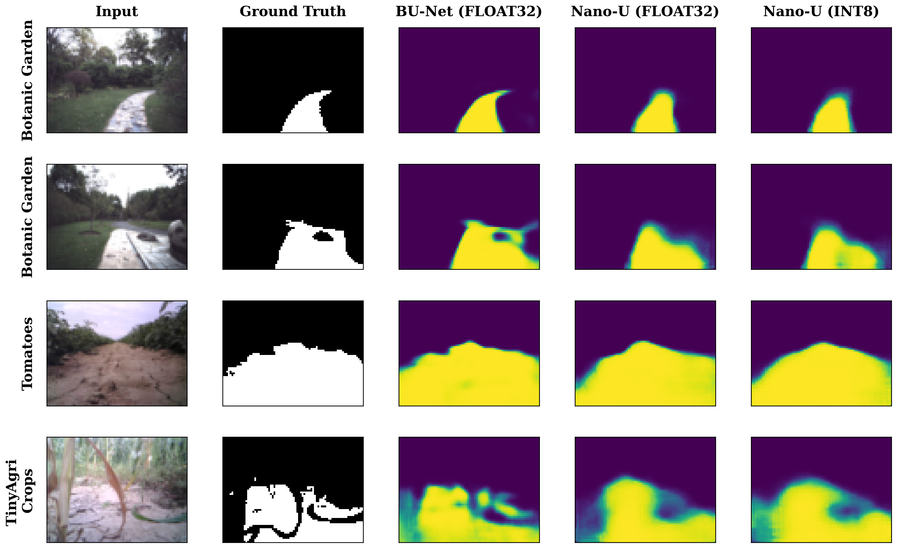
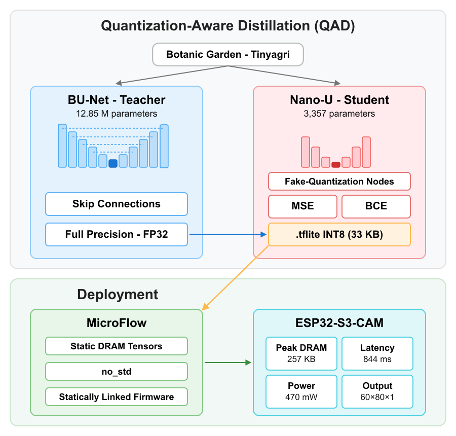
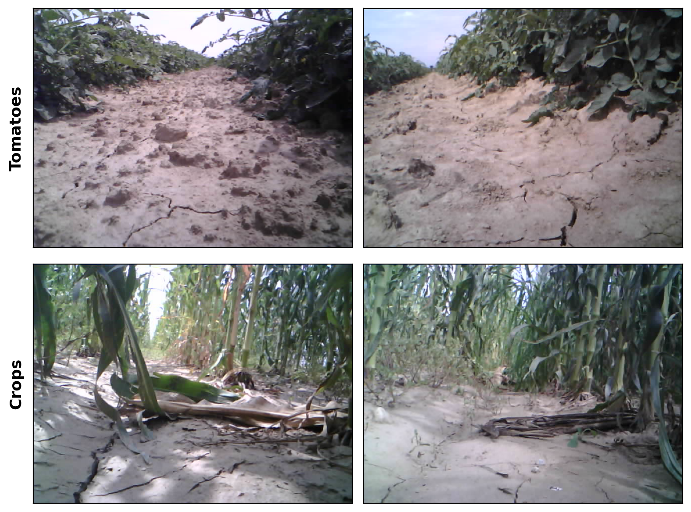

# Nano-U

> **3,357-parameter binary terrain segmentation for bare-metal microcontrollers.**  
> Trained via Quantization-Aware Distillation · Deployed in Rust · Runs at 1.2 FPS on a $10 SoC.

[](https://www.python.org/)
[](https://www.tensorflow.org/)
[](https://esp-rs.github.io/book/)
[](LICENSE)
[](LICENSE)
[](https://huggingface.co/datasets/federico-pizz/TinyAgri)

---

Nano-U is a minimal encoder-decoder segmentation network designed from the ground up for autonomous navigation on commodity embedded hardware. Its architecture, training regime, and deployment stack are co-designed around a single hard constraint: **320 KB of Data RAM, no ML accelerator**.

The model is trained with **Quantization-Aware Distillation (QAD)** — a single-pass regime that fuses knowledge distillation from a full-precision BU-Net teacher with INT8 fake-quantization from epoch one — and deployed through a [fork of MicroFlow](https://github.com/federico-pizz/microflow-rs), a compile-time Rust inference engine that resolves the entire operator graph at build time with no heap allocator, no dynamic dispatch, and no interpreter overhead.

---

## Results

### Segmentation Accuracy

| Model | Dataset | mIoU | F1 | Precision | Recall |
|:---|:---|:---:|:---:|:---:|:---:|
| BU-Net (Teacher, Float32) | Botanic Garden | 95.2% | 95.8% | 96.9% | 94.7% |
| Nano-U (Float32) | Botanic Garden | 87.6% | 88.3% | 94.0% | 83.3% |
| **Nano-U (INT8, on ESP32)** | **Botanic Garden** | **87.6%** | **88.4%** | **94.1%** | **83.3%** |
| BU-Net (Teacher, Float32) | TinyAgri | 90.9% | 95.2% | 93.9% | 96.5% |
| Nano-U (Float32) | TinyAgri | 88.4% | 93.7% | 93.5% | 94.0% |
| **Nano-U (INT8, on ESP32)** | **TinyAgri** | **88.4%** | **93.7%** | **93.5%** | **93.9%** |

The negligible Float32→INT8 gap on both domains (≈0 pp mIoU) confirms the QAD pipeline preserves accuracy through quantization — the on-device INT8 model matches its Float32 source within measurement noise.

### Qualitative Results

Side-by-side comparison of raw input, ground-truth mask, and Nano-U INT8 prediction across both domains:



### Training Pipeline

The diagram below shows the QAD training loop: fake-quantization nodes are injected from epoch one so the optimizer simultaneously minimizes distillation loss (teacher soft targets) and quantization error (INT8 rounding).



### Hardware Efficiency (ESP32-S3-CAM)

| Metric | Value |
|:---|:---:|
| Parameters | 3,357 (INT8) |
| Model size | 33 KB |
| Peak internal RAM | 281 KB |
| Inference latency | 830 ms (~1.2 FPS) |
| Power consumption | 470 mW |

Peak RAM measured via stack painting (hardware high-water mark). Power measured at the 5V USB rail, inclusive of LDO, OV2640 camera, and USB-UART bridge.

---

## Architecture

Nano-U is a strictly sequential 7-stage encoder-decoder. Skip connections are omitted — retaining encoder feature maps in SRAM until the decoder consumes them would exceed the 320 KB budget. Depthwise separable convolutions (K=3) are used throughout.

| Stage | Spatial | Channels | Operation |
|:---|:---:|:---:|:---|
| Encoder 1 | 60×80 → 30×40 | 3 → 4 | DW-Sep Conv × 2, MaxPool 2×2 |
| Encoder 2 | 30×40 → 15×20 | 4 → 8 | DW-Sep Conv × 2, MaxPool 2×2 |
| Encoder 3 | 15×20 → 5×10 | 8 → 16 | DW-Sep Conv × 2, MaxPool **3×2** |
| Bottleneck | 5×10 | 16 | DW-Sep Conv × 2 |
| Decoder 1 | 5×10 → 15×20 | 16 → 8 | NN Upsample 3×2, DW-Sep Conv × 2 |
| Decoder 2 | 15×20 → 30×40 | 8 → 4 | NN Upsample 2×2, DW-Sep Conv × 2 |
| Decoder 3 | 30×40 → 60×80 | 4 → 1 | NN Upsample 2×2, DW-Sep Conv × 2 |

The asymmetric 3×2 MaxPool at Stage 3 reduces 15×20 cleanly to 5×10 without spatial misalignment. The largest intermediate tensor is 60×80×4 = 19.2 KB (INT8), keeping the total arena within budget.

The parameter count is reported at three stages: the plain Float32 architecture has **4,212** weights; quantization-aware training wraps these in fake-quant nodes for a saved-checkpoint count of **4,688**; and at TFLite export the batch-normalization statistics are folded into the preceding convolutions, leaving **3,357** stored INT8 parameters with no accuracy loss.

SVD-based redundancy scores (`src/nas.py`) are tracked during training to monitor layer utilization. These scores empirically confirm that encoder layers generalize across domains while decoder layers are domain-specific — motivating the decoder-only re-distillation strategy described in [Limitations](#limitations).

### Quantization-Aware Distillation

$$\mathcal{L} = \alpha \cdot T^2 \cdot \mathcal{L}_\text{KD} + (1 - \alpha) \cdot \mathcal{L}_\text{CE}$$

where $\mathcal{L}_\text{KD}$ is MSE between temperature-scaled sigmoid outputs of teacher and student, $\mathcal{L}_\text{CE}$ is binary cross-entropy against hard labels, and $T^2$ compensates for gradient magnitude reduction from temperature scaling. Fake-quantization nodes are injected from epoch one so the optimizer minimizes distillation loss and quantization error simultaneously.

---

## Datasets

Nano-U is dataset-agnostic: any binary terrain-segmentation dataset laid out as
`data/<name>/{train,val,test}/{img,mask}` works by pointing `config/config.yaml` at it.
The two datasets below are the ones used for the results in this repository and its
accompanying publication.

### Botanic Garden
An outdoor robot navigation benchmark collected in a 48,000 m² unstructured environment. We use 1,181 images from all 5 annotated sequences, split by contiguous sequence (70/20/10) to prevent temporal leakage. Binary traversability masks are derived from the original *path* class annotations.

**Original Source:** [robot-pesg/BotanicGarden](https://github.com/robot-pesg/BotanicGarden)

### TinyAgri
A custom terrain segmentation dataset collected via the onboard OV2640 camera of an ESP32-CAM mounted on a SunFounder Galaxy RVR rover. It contains 2,659 images across two agricultural environments (tomato and corn fields), annotated with SAM 2. TinyAgri is released alongside this project to support future research in edge robotics.



---

## Installation

Requires Python 3.12 (TensorFlow has no wheels for 3.13/3.14).

```bash
git clone https://github.com/federico-pizz/Nano-U.git
cd Nano-U
python -m venv .venv && source .venv/bin/activate
pip install -r requirements.txt
```

### GPU (optional)

The pinned install is CPU-only so it works everywhere; the test suite runs on CPU and
GPU-marked tests skip automatically. For an NVIDIA GPU, install a CUDA-capable build:

```bash
pip install "tensorflow[and-cuda]==2.20.0"
```

> Very new GPUs (RTX 50-series / Blackwell, sm_120) aren't covered by stock TensorFlow
> builds yet — they need a CUDA 12.8+ toolkit and a TensorFlow nightly, typically in a
> separate conda environment. See NVIDIA's Blackwell compatibility guide.

For Rust firmware build and deployment, see [`firmware/README.md`](firmware/README.md).

---

## Usage

### Pre-trained Models

Pre-trained INT8 TFLite models for both domains are included in the repository under `models/`:

```
models/
├── BotanicGarden/nano_u.tflite
└── TinyAgri/nano_u.tflite
```

You can run evaluation directly against these without training from scratch (see [Evaluate](#evaluate) below).

### Training

Copy and fill in `config/config.yaml` with your dataset paths, then choose one of the two options below — they are mutually exclusive.

**Option A — QAD Pipeline (recommended)**

Runs all four phases in one shot: teacher training → student training with distillation → INT8 TFLite export → evaluation.

```bash
python scripts/run_qad.py --config config/config.yaml
```

**Option B — Standard training (no distillation)**

Trains teacher and student independently without knowledge distillation.

```bash
python scripts/train_model.py bu_net --config config/config.yaml   # Teacher
python scripts/train_model.py nano_u --config config/config.yaml   # Student
```

### Evaluate

```bash
python src/evaluate.py nano_u --config config/config.yaml            # held-out test split
python src/evaluate.py nano_u --config config/config.yaml --split val --threshold 0.6
```

Reports mIoU, Dice, precision/recall and the F0.5/F1/F2 family, plus a precision–recall
curve and a metric-vs-threshold sweep. When the frames carry sequence ids it also adds a
per-sequence variance breakdown (plot + a full `*_report.json`). Outputs land in
`results/<dataset>/<model>/` (`eval_results.json` flat metrics, plus a format-tagged
`eval_results_{fp32,int8}.json`). INT8 TFLite and float Keras models go through the same
forward path.

### Hyperparameter search (leakage-safe CV)

Grouped k-fold sweep over distillation temperature/alpha, augmentation regime, the CE-loss
ablation, and the conservative Tversky term, with each whole capture sequence kept inside one
fold (no temporal leakage). Selects by mIoU with F0.5 as the safety tiebreak; writes
`results/<dataset>/cv/cv_results.{json,csv}`.

```bash
python scripts/cv_search.py --config config/config.yaml --k 4 --epochs 200 \
    --temperatures 2 4 8 --alphas 0.3 0.5 0.7 \
    --regimes none geometric photometric full --ce on off \
    --tversky 0.0 0.5 --jobs 3
```

`--ce on off` toggles the CE term (off ≡ `alpha=1.0`); `--tversky` sweeps the precision-favoring
supervised loss `(1-w)·BCE + w·Tversky` (default `0.0` = pure BCE). `--jobs N` runs N **student**
pipelines concurrently (one process/GPU context each); set it to how many tiny Nano-U pipelines
fit in VRAM. The heavy BU-Net teacher has its own `--teacher-jobs` (default 1, sequential) —
three concurrent teachers OOM a ~6 GB GPU. `--k` must be ≤ the number of distinct sequences.

### On-Device Evaluation

```bash
python scripts/eval_esp32.py nano_u --config config/config.yaml
```

### MCU Deployment

See [`firmware/README.md`](firmware/README.md) for build setup, binary descriptions, and environment variables.

---

## Project Structure

```
Nano-U/
├── config/config.yaml          # Configuration template
├── src/
│   ├── models/                 # Nano-U and BU-Net builders
│   ├── utils/                  # Metrics, QAT wrappers, config loader
│   ├── data.py                 # tf.data pipelines and augmentation
│   ├── evaluate.py             # Evaluation and visualization
│   ├── nas.py                  # SVD-based redundancy monitoring
│   ├── quantize_model.py       # INT8 TFLite export and calibration
│   └── train.py                # Training loops (standard + distillation)
├── scripts/
│   ├── run_qad.py              # Full QAD pipeline
│   ├── cv_search.py            # Leakage-safe grouped-CV hyperparameter search
│   ├── train_model.py          # Single-model training
│   ├── eval_esp32.py           # On-device inference and evaluation
│   ├── capture_view.py         # Decode live-camera frame dumps (capture bin) to PNG
│   └── profile_nano_u.py       # Stack painting and energy profiling
├── firmware/                   # ESP32-S3 bare-metal Rust
│   ├── src/bin/
│   │   ├── online.rs                 # Live-camera control loop (OV2640 → nav decision)
│   │   ├── capture.rs                # Live-camera frame dump for pipeline validation
│   │   ├── run.rs                    # Continuous inference loop (default target)
│   │   ├── inference.rs              # One-shot INT8 benchmark over all test images
│   │   ├── single_inference.rs       # Single-image inference + serial output
│   │   ├── analysis.rs               # Stack painting + power profiling (Nano-U)
│   │   └── analysis_person_detect.rs # Stack painting + power profiling (person_detect)
│   ├── src/camera.rs                 # OV2640 live-capture driver
│   ├── src/control.rs                # Pure navigation policy
│   └── build.rs                      # Compile-time quantization param extraction + image packing
├── models/
│   ├── BotanicGarden/nano_u.tflite
│   └── TinyAgri/nano_u.tflite
└── data/
    ├── BotanicGarden/
    └── TinyAgri/
```

---

## Hardware

All experiments use an **ESP32-S3-CAM** (dual-core Xtensa LX7 @ 240 MHz, 512 KB internal SRAM, 16 MB PSRAM, OV2640 camera). No ML accelerator is present; all integer arithmetic runs on the general-purpose ALU. See [`firmware/README.md`](firmware/README.md) for build, binary descriptions, and environment variables.

---

## Limitations

- **Single-core inference**: the second Xtensa LX7 core is idle. Distributing inference across both cores is the most direct path to halving latency.
- **Fixed-domain deployment**: Nano-U is currently re-trained from scratch per domain. SVD redundancy scores suggest the encoder generalizes while the decoder is domain-specific, motivating decoder-only re-distillation for new domains.

---

## Citation

If you use Nano-U or the TinyAgri dataset, please cite:

```bibtex
@misc{pizzolato2026nanou,
      title={Nano-U: Efficient Terrain Segmentation for Tiny Robot Navigation}, 
      author={Federico Pizzolato and Francesco Pasti and Nicola Bellotto},
      year={2026},
      eprint={2605.10210},
      archivePrefix={arXiv},
      primaryClass={cs.RO},
      url={https://arxiv.org/abs/2605.10210}, 
}
```

---

## License

This project is dual-licensed under the **MIT License** and the **Apache License 2.0**.  
You may use it under the terms of either license, at your option.

See [LICENSE](LICENSE) for the full text of both licenses.
