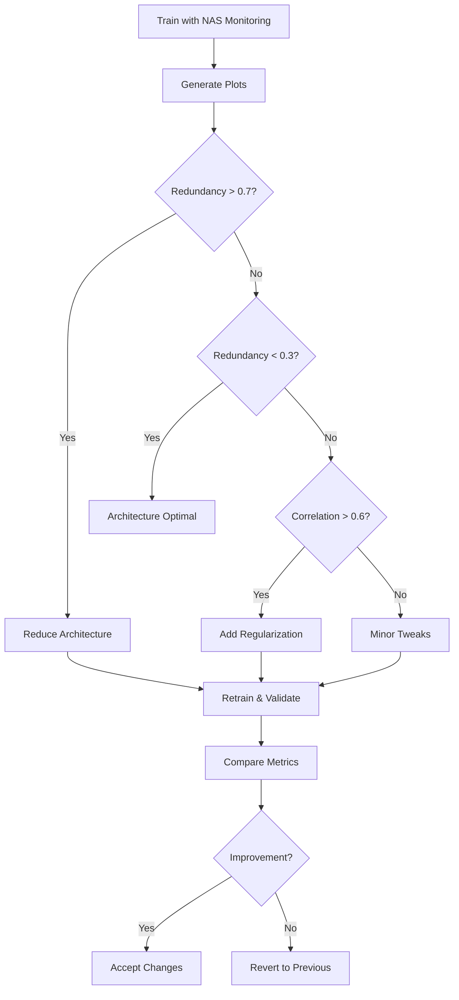

# NAS Monitoring System - Callback-Based Architecture Analysis

## Overview

The Nano-U project includes a **callback-based NAS (Neural Architecture Search) monitoring system** that helps analyze model efficiency during training without requiring layer introspection or modifying the training loop.

### Key Features

- ✅ **Non-invasive**: Works via Keras callbacks - no changes to training loop
- ✅ **Universal**: Compatible with any model architecture (functional or subclassed)
- ✅ **Comprehensive**: Tracks redundancy, correlation, numerical stability
- ✅ **Visual**: Generates publication-quality plots with actionable recommendations
- ✅ **Efficient**: Minimal overhead (<5% training time impact)

### Core Components

1. **[`NASMonitorCallback`](../src/nas_covariance.py)**: Keras callback that monitors feature redundancy
2. **[`src/train.py`](../src/train.py)**: Training script with `--enable-nas` flag
3. **[`src/train_with_nas.py`](../src/train_with_nas.py)**: Simplified wrapper (NAS always enabled)
4. **[`src/plot_nas_metrics.py`](../src/plot_nas_metrics.py)**: Visualization and analysis tool

---

## Quick Start

### 1. Enable NAS Monitoring During Training

```bash
# Basic usage with defaults
python src/train.py --model nano_u --epochs 50 --enable-nas

# Custom NAS configuration
python src/train.py --model nano_u --epochs 50 --enable-nas \
  --nas-log-dir logs/my_experiment \
  --nas-csv-path logs/nano_u_metrics.csv \
  --nas-log-freq epoch

# Batch-level monitoring (more granular)
python src/train.py --model nano_u --enable-nas \
  --nas-log-freq batch --nas-batch-freq 10

# Using the simplified wrapper (NAS always enabled)
python src/train_with_nas.py --model nano_u --epochs 50
```

### 2. Visualize Results

```bash
# Generate all plots
python src/plot_nas_metrics.py \
  --csv logs/nas/nano_u_nas_metrics.csv \
  --all \
  --output-dir plots/

# Generate specific plot type
python src/plot_nas_metrics.py \
  --csv logs/nas/nano_u_nas_metrics.csv \
  --plot-type dashboard \
  --output plots/dashboard.png

# Get architecture recommendations
python src/plot_nas_metrics.py \
  --csv logs/nas/nano_u_nas_metrics.csv \
  --recommendations
```

### 3. Compare Multiple Models

```bash
# Train different configurations
python src/train_with_nas.py --model nano_u --epochs 50
cp logs/nas/nano_u_nas_metrics.csv logs/nano_u_baseline.csv

python src/train_with_nas.py --model bu_net --epochs 50
cp logs/nas/bu_net_nas_metrics.csv logs/bu_net_baseline.csv

# Compare
python src/plot_nas_metrics.py \
  --compare logs/nano_u_baseline.csv logs/bu_net_baseline.csv \
  --output plots/model_comparison.png
```

---

## How It Works

### Callback-Based Monitoring

Unlike traditional NAS approaches that require layer introspection, our system uses Keras callbacks to monitor the model's **output activations** during training:

```python
class NASMonitorCallback(tf.keras.callbacks.Callback):
    def on_epoch_end(self, epoch, logs=None):
        # Get model output on validation batch
        y_pred = self.model(x_val, training=False)
        
        # Compute covariance-based metrics
        redundancy = compute_redundancy(y_pred)
        correlation = compute_correlation(y_pred)
        
        # Log to TensorBoard and CSV
        self._log_metrics(epoch, redundancy, correlation, ...)
```

**Advantages**:
- ✅ No layer introspection required
- ✅ Works with any model architecture
- ✅ Non-invasive (doesn't modify training loop)
- ✅ Easy to extend with custom metrics

### Metrics Tracked

| Metric | Description | Target Range | Interpretation |
|--------|-------------|--------------|----------------|
| **Redundancy Score** | Ratio of trace to max eigenvalue | < 0.5 | High values indicate overparameterization |
| **Correlation Mean** | Average correlation between features | < 0.3 | High values indicate redundant features |
| **Correlation Std** | Standard deviation of correlations | - | Variance in feature relationships |
| **Trace** | Sum of eigenvalues (total variance) | - | Overall feature energy |
| **Condition Number** | Ratio of max/min eigenvalues | < 1e6 | Numerical stability indicator |

---

## Configuration

### Config File (`config/config.yaml`)

```yaml
nas:
  enabled: false              # Default disabled for regular training
  log_dir: "logs/nas"        # TensorBoard logs directory
  csv_path: null             # CSV path (null = auto-generate)
  log_freq: "epoch"          # Options: "epoch" or "batch"
  monitor_batch_freq: 10     # When log_freq="batch", monitor every N batches
  
  thresholds:
    high_redundancy: 0.7     # Redundancy above this suggests overparameterization
    low_redundancy: 0.3      # Redundancy below this indicates good utilization
    high_correlation: 0.5    # Correlation above this suggests feature redundancy
    poor_conditioning: 1.0e6 # Condition number above this indicates numerical issues
```

### Command-Line Arguments

#### Training with NAS (`src/train.py`)

```bash
--enable-nas              # Enable NAS monitoring
--nas-log-dir PATH        # TensorBoard log directory
--nas-csv-path PATH       # CSV output path
--nas-log-freq {epoch,batch}  # Logging frequency
--nas-batch-freq INT      # Batch monitoring interval
```

#### Visualization (`src/plot_nas_metrics.py`)

```bash
--csv PATH                # Single CSV file to analyze
--compare PATH [PATH ...] # Compare multiple CSV files
--output PATH             # Output file path
--output-dir DIR          # Output directory for multiple plots
--all                     # Generate all plot types
--plot-type {redundancy,correlation,dashboard,comparison}
--model-name NAME         # Model name for plot titles
--recommendations         # Print architecture recommendations
```

---

## Visualization Types

### 1. Redundancy Over Time


Shows how feature redundancy evolves during training:
- **Decreasing**: Model learning efficient representations ✅
- **Increasing**: Possible overfitting or overparameterization ⚠️
- **Stable**: Consistent feature usage

### 2. Correlation Analysis


Visualizes feature correlation patterns:
- **Green zone (0-0.3)**: Low correlation, diverse features ✅
- **Yellow zone (0.3-0.6)**: Moderate correlation
- **Red zone (0.6-1.0)**: High correlation, redundant features ⚠️

### 3. Comprehensive Dashboard


Multi-panel view showing:
- Redundancy trend
- Correlation trend with confidence intervals
- Distribution histograms
- Summary statistics table

### 4. Model Comparison


Side-by-side comparison of multiple model configurations showing relative efficiency.

---

## Interpreting Results

### Redundancy Score Interpretation

| Score | Status | Recommendation |
|-------|--------|----------------|
| **> 0.7** | ⚠️ High Redundancy | Reduce filters by 25-30%, decrease bottleneck by 25% |
| **0.5-0.7** | ⚙️ Moderate | Reduce filters by 10-15% |
| **0.3-0.5** | ✅ Good | Architecture is reasonable, minor optimizations possible |
| **< 0.3** | ✅ Excellent | Model is well-sized, features are diverse |

### Correlation Interpretation

| Correlation | Status | Recommendation |
|-------------|--------|----------------|
| **> 0.6** | ⚠️ Highly Correlated | Reduce filter count, features are redundant |
| **0.3-0.6** | ⚙️ Moderate | Architecture is acceptable |
| **< 0.3** | ✅ Diverse | Good feature learning |

### Example Analysis Output

```
============================================================
NAS ANALYSIS RECOMMENDATIONS FOR NANO_U
============================================================

1. REDUNDANCY ANALYSIS:
   ⚠️  HIGH REDUNDANCY (final=0.743)
   → Consider reducing bottleneck size or decoder filters
   → High redundancy indicates wasted capacity

2. CORRELATION ANALYSIS:
   ℹ️  MODERATE CORRELATION (final=0.412)
   → Features have some redundancy
   → Consider adding dropout or reducing layer width

3. NUMERICAL STABILITY:
   ✓ GOOD CONDITIONING (final=2.34e4)
   → Excellent numerical stability

4. TRAINING DYNAMICS:
   ✓ Redundancy DECREASING over training
   → Model is learning efficient representations

5. OVERALL RECOMMENDATION:
   ⚠️  ARCHITECTURE NEEDS OPTIMIZATION
   → Reduce model width or bottleneck size by 25-50%
   → Add regularization (dropout, weight decay)

============================================================
```

---

## Advanced Usage

### Custom NAS Configuration in Code

```python
from src.train import train

# Train with custom NAS config
train(
    model_name="nano_u",
    epochs=100,
    batch_size=8,
    lr=1e-4,
    enable_nas_monitoring=True,
    nas_log_dir="experiments/run_1/nas",
    nas_csv_path="experiments/run_1/metrics.csv",
    nas_log_freq="epoch",
    nas_monitor_batch_freq=10
)
```

### Accessing Metrics Programmatically

```python
import pandas as pd

# Load metrics
df = pd.read_csv("logs/nas/nano_u_nas_metrics.csv")

# Analyze
print(f"Mean redundancy: {df['redundancy_score'].mean():.4f}")
print(f"Final redundancy: {df['redundancy_score'].iloc[-1]:.4f}")
print(f"Redundancy trend: {df['redundancy_score'].iloc[-5:].mean() - df['redundancy_score'].iloc[:5].mean():.4f}")
```

### Integrating with Pipeline

```bash
# Via pipeline script (when implemented)
python scripts/tf_pipeline.py train --model nano_u --enable-nas

# Or direct usage
python src/train.py --model nano_u --enable-nas --epochs 100
```

---

## Architecture Decision Workflow



---

## Best Practices

### When to Use NAS Monitoring

✅ **Use When**:
- Designing new architectures
- Optimizing model size for deployment
- Investigating overfitting issues
- Comparing architecture variants
- Analyzing feature utilization

❌ **Don't Use When**:
- Running production training (adds overhead)
- Architecture is already validated
- Quick experiments/debugging

### Monitoring Frequency Recommendations

| Scenario | Recommended Frequency | Batch Freq |
|----------|----------------------|------------|
| **Quick validation** | `epoch` | N/A |
| **Detailed analysis** | `batch` | 10-20 |
| **Long training** | `epoch` | N/A |
| **Short training (<10 epochs)** | `batch` | 5 |

### Performance Considerations

- **Epoch monitoring**: <2% overhead
- **Batch monitoring**: 3-5% overhead
- **Validation set size**: Use 50-100 samples for monitoring (reduce if too slow)
- **TensorBoard logging**: Adds ~0.5% overhead

---

## Troubleshooting

### Issue: No metrics logged

**Cause**: Validation data not available  
**Fix**: Ensure validation dataset is provided to `model.fit()`

### Issue: High memory usage

**Cause**: TensorBoard accumulating too much data  
**Fix**: Reduce monitoring frequency or disable TensorBoard logging

### Issue: Metrics seem incorrect

**Cause**: Model output shape mismatch  
**Fix**: Verify model outputs have shape (batch, height, width, channels)

### Issue: CSV file not created

**Cause**: Invalid path or permissions  
**Fix**: Check directory exists and is writable

---

## Testing

### Unit Tests

```bash
# Test NAS monitoring callback
pytest tests/test_nas_callback.py -v

# Test covariance computations
pytest tests/test_nas_covariance.py -v
```

### Integration Test

```bash
# Train small model with NAS monitoring
python src/train.py --model nano_u --epochs 2 --batch-size 4 --enable-nas

# Verify files created
ls logs/nas/  # Should contain CSV and TensorBoard files

# Generate plots
python src/plot_nas_metrics.py --csv logs/nas/*_nas_metrics.csv --all
```

---

## Migration from Old System

### Old Approach (ActivationExtractor - DEPRECATED)

```python
# OLD - Don't use
extractor = ActivationExtractor(model, layer_names)  # ❌ Broken with subclassed models
acts = extractor(x)  # ❌ Fails to find layers
```

### New Approach (NASMonitorCallback - RECOMMENDED)

```python
# NEW - Use this
nas_callback = NASMonitorCallback(
    log_dir="logs/nas",
    csv_path="metrics.csv",
    log_freq="epoch"
)
model.fit(train_ds, validation_data=val_ds, callbacks=[nas_callback])  # ✅ Works everywhere
```

---

## References

- **Master Plan**: [`plans/MASTER_PLAN.md`](../plans/MASTER_PLAN.md)
- **NAS Implementation**: [`src/nas_covariance.py`](../src/nas_covariance.py)
- **Training Script**: [`src/train.py`](../src/train.py)
- **Visualization Tool**: [`src/plot_nas_metrics.py`](../src/plot_nas_metrics.py)
- **Configuration**: [`config/config.yaml`](../config/config.yaml)

---

## Contributing

When extending NAS monitoring:

1. Add new metrics to `NASMonitorCallback._compute_metrics()`
2. Update CSV export to include new columns
3. Add visualization for new metrics in `plot_nas_metrics.py`
4. Document interpretation guidelines above
5. Add unit tests in `tests/test_nas_callback.py`

---

**Last Updated**: 2026-01-16  
**Version**: 2.0 (Callback-based architecture)
