# Executive Summary - Nano-U Project Fixes

## Critical Issues Found

### 1. ❌ Nano_U Has Skip Connections (Should NOT Have Them)
**Impact**: Architecture doesn't match the proven old implementation  
**Fix**: Remove skip connections from [`src/models/Nano_U/model_tf.py`](../src/models/Nano_U/model_tf.py:84-110)

### 2. ❌ train_with_nas.py Cannot Find Layers in Nested Models
**Impact**: NAS training silently fails  
**Fix**: Add recursive layer search in [`src/train_with_nas.py`](../src/train_with_nas.py:348-390)

### 3. ✅ BU_Net Architecture is Correct
**Status**: No changes needed - properly uses depthwise separable convolutions

### 4. ✅ Config-Driven Architecture is Fine
**Status**: Using config.yaml to control model size is good design

---

## Architecture Comparison

```mermaid
graph TB
    subgraph "OLD Nano_U - PyTorch - WORKING"
        A1[Input 48x64x3] --> B1[DoubleConv 32]
        B1 --> C1[AvgPool ↓]
        C1 --> D1[DoubleConv 64]
        D1 --> E1[AvgPool ↓]
        E1 --> F1[DoubleConv 128]
        F1 --> G1[Bottleneck 128]
        G1 --> H1[Upsample ↑]
        H1 --> I1[DoubleConv 64]
        I1 --> J1[Upsample ↑]
        J1 --> K1[DoubleConv 32]
        K1 --> L1[Output 48x64x1]
        
        style A1 fill:#e1f5e1
        style G1 fill:#ffe1e1
        style L1 fill:#e1f5e1
    end
    
    subgraph "NEW Nano_U - TensorFlow - PROBLEM"
        A2[Input 48x64x3] --> B2[DepthSepConv 16]
        B2 -.skip1.-> J2
        B2 --> C2[MaxPool ↓]
        C2 --> D2[DepthSepConv 32]
        D2 -.skip2.-> H2
        D2 --> E2[MaxPool ↓]
        E2 --> F2[DepthSepConv 64]
        F2 --> G2[Bottleneck 64]
        G2 --> H2[Upsample ↑]
        H2 --> I2[Concat + DepthSepConv 32]
        I2 --> J2[Upsample ↑]
        J2 --> K2[Concat + DepthSepConv 16]
        K2 --> L2[Output 48x64x1]
        
        style A2 fill:#e1f5e1
        style G2 fill:#ffe1e1
        style L2 fill:#e1f5e1
        style B2 fill:#fff3cd
        style D2 fill:#fff3cd
        style I2 fill:#ffcccc
        style K2 fill:#ffcccc
    end
```



**Legend**:
- 🟢 Green = Input/Output
- 🔴 Red = Bottleneck
- 🟡 Yellow = Layers with skip connections (PROBLEM)
- 🔴 Red nodes in NEW = Where skip connections are concatenated (REMOVE THESE)

---

## Key Architectural Differences

| Aspect | Old (Working) | New (Current) | Fix Needed |
|--------|---------------|---------------|------------|
| **Skip Connections** | ❌ None | ✅ Yes (U-Net style) | Remove skips |
| **Filters** | [32, 64, 128] | [16, 32, 64] | Config-driven OK |
| **Bottleneck** | 128 | 64 | Config-driven OK |
| **Decoder** | [64, 32] | [32, 16] | Config-driven OK |
| **Conv Blocks** | DoubleConv (2x) | DepthwiseSepConv (1x) | Functionally similar |
| **Pooling** | AvgPool2d | MaxPool2D | Minor - consider changing |
| **Parameters** | ~41K | ~19K (with skips) | Will vary by config |

---

## The Skip Connection Problem Explained

### Without Skip Connections (Old - Simple Autoencoder)
```
Encoder → [32] → [64] → [128] → Bottleneck [128] → [64] → [32] → Output
         ↓      ↓      ↓                          ↑      ↑
      (pool)  (pool)  (pool)                  (upsample)(upsample)
```
- Information flows through bottleneck only
- Forces model to learn compressed representation
- Simpler, fewer parameters
- **Good for embedded deployment**

### With Skip Connections (New - U-Net)
```
Encoder → [16] ──┐→ [32] ──┐→ [64] → Bottleneck → Decoder
         ↓       │  ↓       │                        ↑
      (pool)     │(pool)    │                     (upsample)
                 │          │                        ↓
                 │          └──→ Concat [32+64] → [32] ──┐
                 │                                   ↑    │
                 │                               (upsample)│
                 │                                   ↓    │
                 └──→ Concat [16+32] ────────────→ [16] ─┘→ Output
```
- High-resolution features bypass bottleneck
- Better for preserving spatial details
- More parameters due to concatenation
- **Overhead for embedded deployment**

---

## NAS Layer Detection Bug

### Problem
```python
# Current code searches student_model.layers
for layer in student_model.layers:
    if isinstance(layer, Model):
        # Found nested model but can't access its layers!
        pass

all_conv = [l for l in student_model.layers if isinstance(l, Conv2D)]
# Result: [] (empty) because conv layers are INSIDE nested model
```

### Solution
```python
# Recursive search through all nested models
def get_all_layers_recursive(model):
    layers = []
    for layer in model.layers:
        layers.append(layer)
        if isinstance(layer, tf.keras.Model):
            layers.extend(get_all_layers_recursive(layer))  # RECURSE!
    return layers

all_layers = get_all_layers_recursive(student_model)
all_conv = [l for l in all_layers if isinstance(l, Conv2D)]
# Result: [encoder_conv_0_dw, encoder_conv_0_pw, ...] ✓
```

---

## Implementation Priority

### Phase 1: Critical Fixes (Do First)
1. ✅ **Remove skip connections** from Nano_U model
2. ✅ **Fix recursive layer search** in train_with_nas.py
3. ✅ **Remove inner_model workaround** from NAS classes

### Phase 2: Validation (Do Second)
4. Test basic training without NAS
5. Test NAS training with fixed layer detection
6. Verify parameter counts match expectations

### Phase 3: Optimization (Do Later)
7. Consider changing MaxPool → AvgPool for exact match
8. Add architecture comparison tests
9. Document design decisions

---

## Expected Outcomes

### Before Fixes
- ❌ Nano_U has skip connections (architectural mismatch)
- ❌ NAS silently fails (can't find layers)
- ❌ Training may work but architecture is wrong
- ❌ Model doesn't match proven old implementation

### After Fixes
- ✅ Nano_U matches old simple autoencoder
- ✅ NAS finds layers correctly
- ✅ Training works with and without NAS
- ✅ Architecture matches proven implementation
- ✅ Config-driven flexibility maintained

---

## Files to Modify

1. **[`src/models/Nano_U/model_tf.py`](../src/models/Nano_U/model_tf.py)**
   - Remove skip connection logic from `call()` method (lines 84-110)
   - Optionally change MaxPool → AvgPool (line 69)

2. **[`src/train_with_nas.py`](../src/train_with_nas.py)**
   - Add recursive layer search (lines 348-390)
   - Remove `inner_model` from NASWrapper (lines 56, 84-86)
   - Remove `inner_model` from DistillerWithNAS (lines 118, 168-170)
   - Remove `inner_model` from instantiation calls (lines 399, 480)

---

## Testing Commands

```bash
# 1. Check architecture
python -c "from src.models.Nano_U.model_tf import build_nano_u; \
           m = build_nano_u(); print('Params:', m.count_params())"

# 2. Test basic training (no NAS)
python src/train.py --model nano_u --epochs 1 --batch-size 2

# 3. Test NAS training
python src/train_with_nas.py --model nano_u --epochs 1 --enable-nas

# 4. Test full pipeline
./scripts/tf_pipeline.sh
```

---

## Questions for You

1. **Skip Connections**: Confirm you want them REMOVED to match old implementation? ✓ or ✗

2. **Pooling Type**: Should we change MaxPool → AvgPool for exact match, or keep MaxPool? 

3. **Testing**: Do you have pre-trained old model weights we can compare against?

4. **Priority**: Should we fix basic training first, or NAS immediately?

---

## Next Steps

Ready to implement? The detailed code changes are in [`implementation_guide.md`](./implementation_guide.md).

**Recommendation**: Switch to Code mode to implement the fixes.

---

**Status**: ✅ Planning Complete - Ready for Implementation  
**Complexity**: Medium - 2 critical fixes + testing  
**Risk**: Low - Changes are well-defined and isolated
