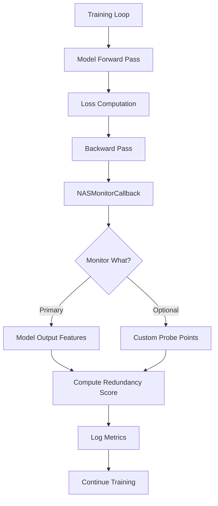

# NAS Callback Implementation Plan
## Option 1: Callback-Based Monitoring Approach

---

## Overview

Implement a **non-invasive NAS monitoring system** using Keras callbacks that works with any model architecture (functional or subclassed). This approach monitors model behavior during training without requiring ActivationExtractor or complex layer introspection.

---

## Architecture Design



---

## Implementation Specification

### 1. NASMonitorCallback Class

**Location**: [`src/nas_covariance.py`](../src/nas_covariance.py)

**Core Features**:
- Monitor model output redundancy per batch or epoch
- Track redundancy trends over training
- Optional: Add custom probe layers for intermediate monitoring
- Log metrics to TensorBoard or console
- Minimal performance overhead

**Class Interface**:
```python
class NASMonitorCallback(tf.keras.callbacks.Callback):
    """
    Non-invasive NAS monitoring via Keras callback.
    
    Monitors feature redundancy during training by computing covariance
    statistics on model outputs or specified probe points.
    
    Args:
        monitor_frequency: 'batch' or 'epoch' - when to compute metrics
        log_frequency: Log every N batches/epochs
        probe_layers: Optional list of layer names to monitor
        redundancy_weight: Optional weight for adding redundancy to loss
        log_dir: Directory for saving metrics (TensorBoard format)
    """
```

**Key Methods**:
- `on_batch_end()`: Batch-level monitoring
- `on_epoch_end()`: Epoch-level monitoring and logging
- `compute_redundancy()`: Core metric computation
- `get_metrics()`: Return current statistics

### 2. Integration Points

#### A. Standard Training ([`src/train.py`](../src/train.py))
```python
# Add optional NAS callback parameter
def train(model_name, epochs, ..., enable_nas_monitoring=False, nas_config=None):
    # ... existing code ...
    
    callbacks = [
        ModelCheckpoint(...),
        ReduceLROnPlateau(...),
        EarlyStopping(...)
    ]
    
    # Add NAS monitoring if requested
    if enable_nas_monitoring:
        from src.nas_covariance import NASMonitorCallback
        nas_callback = NASMonitorCallback(**nas_config)
        callbacks.append(nas_callback)
    
    model.fit(train_ds, validation_data=val_ds, epochs=epochs, callbacks=callbacks)
```

#### B. NAS-Enabled Training ([`src/train_with_nas.py`](../src/train_with_nas.py))
**Simplification Strategy**:
- Remove all ActivationExtractor complexity (lines 348-410)
- Remove NASWrapper and DistillerWithNAS custom Model classes
- Use standard training loop + NAS callback
- Keep simple regularization option if needed

### 3. Monitoring Strategies

#### Strategy A: Output-Only Monitoring (Default)
- Monitor only the final model output
- Compute redundancy on output features
- Zero architectural assumptions
- Works with any model

#### Strategy B: Probe-Based Monitoring (Advanced)
- Add Lambda "probe layers" at strategic points in model
- Callback extracts activations from these probes
- Requires minor model modifications but still non-invasive

**Example Probe Integration**:
```python
# In Nano_U model (optional enhancement)
class Nano_U(tf.keras.Model):
    def __init__(self, ..., enable_probes=False):
        super().__init__()
        # ... existing layers ...
        
        if enable_probes:
            self.encoder_probe = tf.keras.layers.Lambda(lambda x: x, name='nas_encoder_probe')
            self.bottleneck_probe = tf.keras.layers.Lambda(lambda x: x, name='nas_bottleneck_probe')
    
    def call(self, x):
        # ... existing forward pass ...
        # Probes are no-ops but allow callback to access intermediate features
```

### 4. Metrics and Logging

**Tracked Metrics**:
- `redundancy_score`: DeCov-style off-diagonal covariance norm
- `feature_correlation`: Mean correlation between channels
- `condition_number`: Covariance matrix conditioning
- `trace`: Sum of feature variances

**Output Formats**:
1. **Console**: Progress bar with redundancy metrics
2. **TensorBoard**: Scalar metrics for visualization
3. **JSON/CSV**: Exportable for analysis

---

## Implementation Steps (Detailed)

### Phase 1: Core Callback Implementation

**Step 1.1**: Create `NASMonitorCallback` class
- File: [`src/nas_covariance.py`](../src/nas_covariance.py)
- Add after existing classes (~line 580)
- Implement basic structure with `on_epoch_end` only
- Use existing [`covariance_redundancy()`](../src/nas_covariance.py:228-302) function

**Step 1.2**: Add metrics tracking
- Store redundancy scores in list
- Implement `get_metrics()` method
- Add TensorBoard logging support

**Step 1.3**: Test callback standalone
- Create simple test: `tests/test_nas_callback.py`
- Verify callback works with dummy model
- Check metrics computation is correct

### Phase 2: Training Integration

**Step 2.1**: Update [`src/train.py`](../src/train.py)
- Add `enable_nas_monitoring` parameter
- Add `nas_config` dict parameter
- Conditionally append NAS callback to callbacks list

**Step 2.2**: Simplify [`src/train_with_nas.py`](../src/train_with_nas.py)
- Remove ActivationExtractor usage (lines 348-410)
- Remove NASWrapper class (lines 49-114)
- Remove DistillerWithNAS class (lines 116-206)
- Replace with standard training + NAS callback
- Keep file for backward compatibility but make it call train.py with nas=True

**Step 2.3**: Update config
- File: [`config/config.yaml`](../config/config.yaml)
- Add NAS callback configuration section:
  ```yaml
  nas:
    enabled: false
    monitor_frequency: epoch  # or 'batch'
    log_frequency: 1
    redundancy_weight: 0.0  # optional: add to loss
    probe_layers: []  # optional: layer names to monitor
  ```

### Phase 3: Testing & Validation

**Step 3.1**: Create test script
- File: `tests/test_nas_callback_integration.py`
- Test with Nano_U and BU_Net
- Verify no errors during training
- Check metrics are logged

**Step 3.2**: Run training comparison
- Train Nano_U without NAS: baseline
- Train Nano_U with NAS monitoring: compare metrics
- Document any insights in experiment notes

**Step 3.3**: Verify performance overhead
- Measure training time with/without callback
- Ensure overhead is <5%

### Phase 4: Documentation & Cleanup

**Step 4.1**: Update [`docs/NAS_README.md`](../docs/NAS_README.md)
- Document new callback approach
- Add usage examples
- Explain monitored metrics
- Show how to interpret results

**Step 4.2**: Add usage examples
- Console example: `python src/train.py --enable-nas`
- Config file example
- Code example for custom usage

**Step 4.3**: Update pipeline script
- File: [`scripts/tf_pipeline.py`](../scripts/tf_pipeline.py)
- Add `--enable-nas-monitoring` flag
- Pass through to train.py

### Phase 5: Optional Enhancements

**Step 5.1**: Add probe layer support (if needed)
- Modify Nano_U and BU_Net to accept `enable_probes` parameter
- Add Lambda probe layers at key points
- Update callback to extract from probes

**Step 5.2**: Add optional regularization
- Allow callback to contribute to training loss
- Implement `on_batch_end` for per-batch regularization
- Make this opt-in via config

---

## Success Criteria

✅ **Functional**:
- [ ] NASMonitorCallback works with both Nano_U and BU_Net
- [ ] No errors during training with callback enabled
- [ ] Metrics are computed and logged correctly

✅ **Performance**:
- [ ] Training overhead < 5%
- [ ] Memory overhead negligible
- [ ] Can disable callback with single flag

✅ **Usability**:
- [ ] Clear documentation with examples
- [ ] Easy to enable/disable via config
- [ ] Metrics are interpretable

✅ **Quality**:
- [ ] Unit tests pass
- [ ] Integration tests pass
- [ ] Code is clean and simple (~100-150 lines for callback)

---

## Migration Strategy

### From Current (Broken) Implementation

**Remove**:
- Complex ActivationExtractor layer detection logic
- NASWrapper custom Model class
- DistillerWithNAS custom Model class
- All nested model introspection code

**Keep**:
- [`covariance_redundancy()`](../src/nas_covariance.py:228-302) function
- [`RunningCovariance`](../src/nas_covariance.py:401-508) class
- [`nas_analyze.py`](../src/nas_analyze.py) for post-training analysis
- Core covariance math utilities

**Add**:
- NASMonitorCallback class
- Simple integration in train.py
- Configuration options

---

## Usage Examples

### Basic Monitoring
```bash
# Monitor redundancy during training
python src/train.py --model nano_u --epochs 50 --enable-nas-monitoring
```

### With Custom Config
```bash
# Use config file
python src/train.py --config config/config.yaml --model nano_u
# config.yaml has nas.enabled: true
```

### Programmatic Usage
```python
from src.train import train
from src.nas_covariance import NASMonitorCallback

nas_callback = NASMonitorCallback(
    monitor_frequency='epoch',
    log_frequency=5,
    log_dir='logs/nas'
)

model, history = train(
    model_name='nano_u',
    epochs=50,
    enable_nas_monitoring=True,
    nas_callback=nas_callback
)

# Access metrics
metrics = nas_callback.get_metrics()
print(f"Final redundancy: {metrics['redundancy'][-1]:.4f}")
```

---

## Benefits of This Approach

1. **Simplicity**: ~100-150 lines of new code vs 500+ lines of complex introspection
2. **Compatibility**: Works with ANY Keras model (functional or subclassed)
3. **Non-invasive**: No changes to model architecture or training loop
4. **Debuggable**: Clear, straightforward code path
5. **Flexible**: Easy to extend with custom metrics
6. **Performant**: Minimal overhead
7. **Maintainable**: Standard Keras callback pattern

---

## Future Enhancements (Optional)

- **Multi-layer monitoring**: Add probe layers for intermediate features
- **Automated pruning**: Use redundancy scores to suggest layer pruning
- **Comparative analysis**: Compare redundancy across different architectures
- **Visualization**: Real-time redundancy heatmaps
- **Export**: Save redundancy trends for offline analysis
